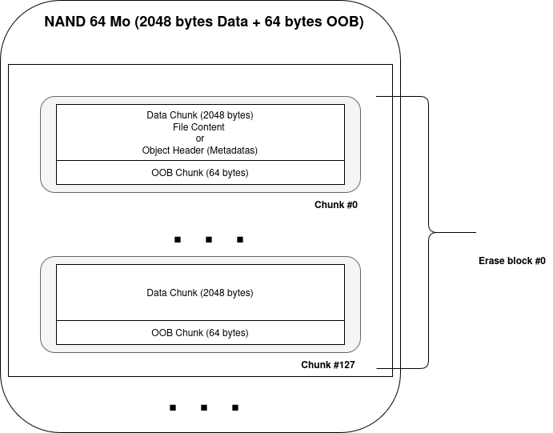
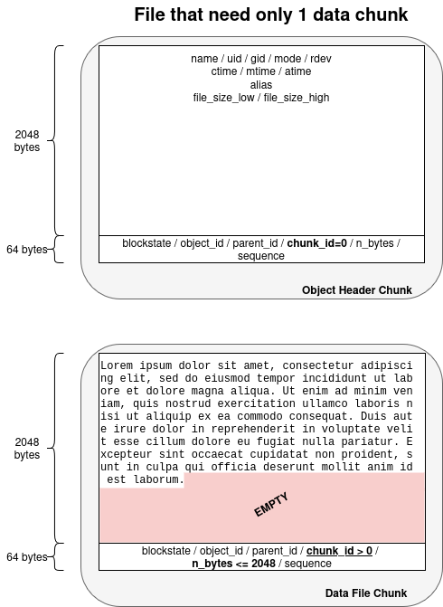
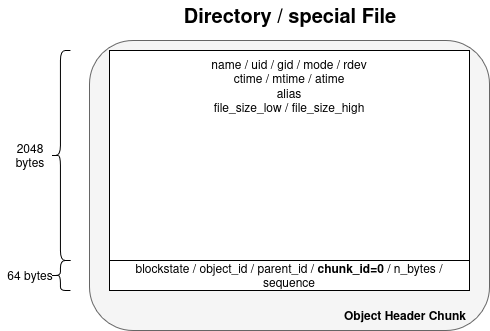
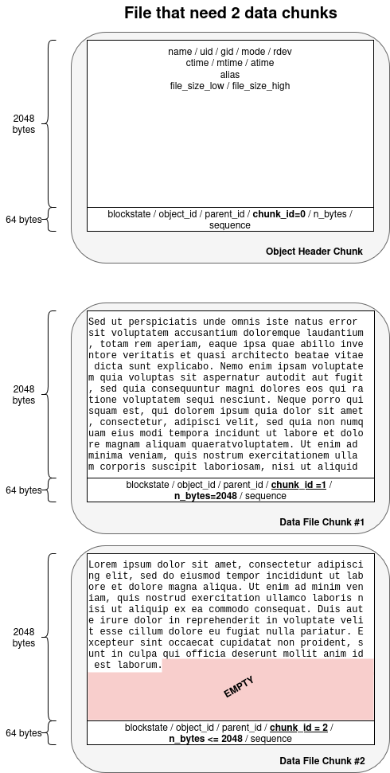
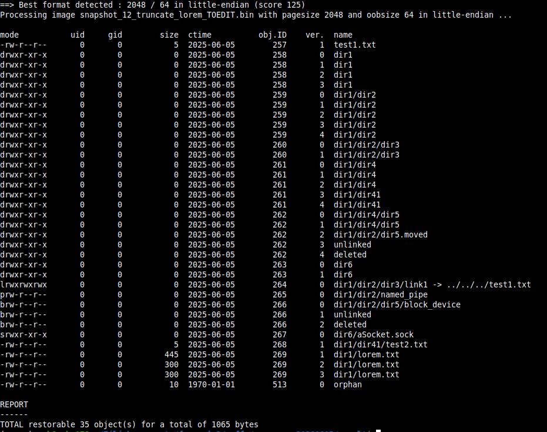
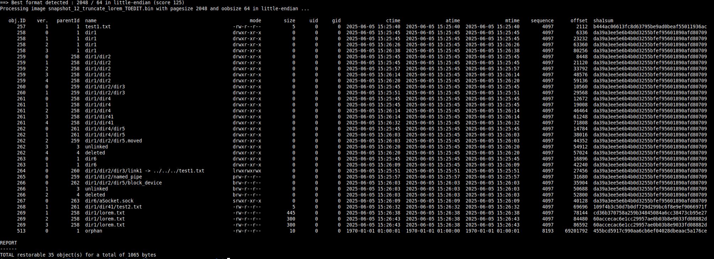
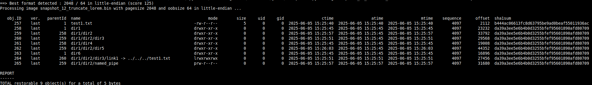
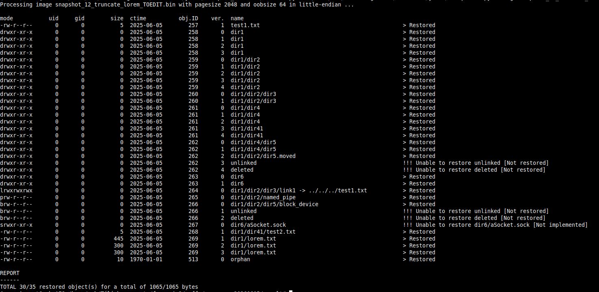

Forensic study of  
YAFFS2 filesystem

(Study)

*redactor* : <buhtig@hashment.com>

# <span id="anchor"></span>Understanding the YAFFS2 Filesystem

In the world of embedded systems and mobile devices, data storage must
be reliable, efficient, and adaptable to hardware constraints. The
YAFFS2 (Yet Another Flash File System version 2) filesystem emerged as a
response to the unique challenges posed by NAND flash memory — a common
non-volatile storage medium in many embedded platforms.

## <span id="anchor-1"></span>History of YAFFS and YAFFS2

YAFFS was initially developed in 2002 by Charles Manning of Aleph One
Ltd, specifically designed to work with NAND flash memory.

> **NAND Flash** is a high-density, block-based, non-volatile memory
> used primarily for data storage. It's efficient and inexpensive, but
> requires careful management due to block erasure limits, bad blocks,
> and write constraints — challenges that YAFFS2 handles through its
> flash-aware architecture.

While other filesystems at the time, such as JFFS and JFFS2, were aimed
at NOR flash, they did not handle the characteristics of NAND well —
especially its susceptibility to bit errors, bad blocks, and the need
for wear leveling.

YAFFS introduced a fresh approach by managing NAND-specific features
natively, providing better performance and reliability for embedded
applications. As NAND technology evolved, larger page sizes and
out-of-band (OOB) data requirements became more prevalent. To support
these changes, YAFFS2 was introduced.

YAFFS2 extended the original design with:

- Support for larger page sizes (e.g., 2KB, 4KB)
- Checkpointing to reduce mount time
- Efficient handling of metadata and deleted files
- Versioning and object-based data representation

Unlike traditional file systems, YAFFS2 directly interfaces with the raw
flash device, using its own wear leveling, error handling, and garbage
collection algorithms.

## <span id="anchor-2"></span>Uses and Applications

YAFFS2 has seen widespread adoption in a range of embedded and mobile
devices, particularly in the early days of smartphones and IoT systems.
Its key advantages — low overhead, simplicity, and robustness — made it
a preferred choice for:

- **Android devices (pre-ext4 era)**  
  Many early Android phones used YAFFS2 before transitioning to ext4 and
  F2FS.
- **Routers and network appliances**  
  Devices like OpenWrt-based routers often use YAFFS2 to store firmware
  and configurations.
- **Industrial control systems**  
  Robust and minimalistic, YAFFS2 fits the needs of devices with tight
  memory and performance constraints.
- **Custom embedded Linux platforms**  
  Developers can integrate YAFFS2 into their kernel to take full control
  over how data is stored and managed on NAND.

Despite newer filesystems gaining popularity, YAFFS2 remains relevant in
scenarios where direct flash access, full control over wear and error
handling, and minimal dependencies are crucial.

# <span id="anchor-3"></span>The Philosophy and Core Principles of YAFFS2

YAFFS2 is more than just a filesystem adapted to NAND flash — it
embodies a design philosophy built around simplicity, efficiency, and
robustness, tailored specifically for the limitations and strengths of
raw NAND memory. Understanding its core principles is key to grasping
both its behavior and the forensic challenges it presents.

## <span id="anchor-4"></span>Designed for NAND, Not Adapted to It

Unlike filesystems retrofitted to work on flash storage, YAFFS2 was
designed from the ground up for NAND flash. NAND has characteristics
that make it fundamentally different from block devices like hard drives
or SSDs, including:

- **No random write access** — data must be written in pages and erased
  in blocks.
- **Presence of bad blocks** — NAND flash can have faulty sectors from
  the factory.
- **Bit errors over time** — requiring error correction (ECC)
  mechanisms.
- **Finite write/erase cycles** — making wear leveling critical.

YAFFS2 acknowledges these constraints and builds a structure that
embraces them rather than hiding them.

## <span id="anchor-5"></span>Object-Based Storage Model

YAFFS2 uses an object-based model, where every file, directory, symlink,
or special node is represented as an object with a unique ID. This
structure is flat and simple:

- Each object is associated with a header chunk (metadata)
- Data is stored in data chunks, numbered sequentially
- Chunks are written append-only — changes result in new chunks, not
  overwrites

This model makes versioning, recovery, and forensic analysis inherently
more feasible compared to traditional filesystems that overwrite data.

## <span id="anchor-6"></span>Append-Only Write Strategy

To mitigate flash wear and avoid complex metadata rewrites, YAFFS2 uses
an append-only strategy:

- New data or metadata is always written to a new location
- Old chunks are marked obsolete and cleaned later by garbage collection
- This approach prevents in-place updates and reduces the risk of
  corruption during power failures

This also means deleted or previous versions of files often remain
accessible on the flash until cleaned, a key opportunity for forensic
recovery.

## <span id="anchor-7"></span>No Reliance on Traditional File Allocation Tables

YAFFS2 does not maintain a central file allocation table. Instead, it
reconstructs the file structure during mounting by scanning the flash
for object headers and data chunks. To improve boot speed, it optionally
uses a checkpointing mechanism to store a snapshot of the state.

This decentralization:

- Reduces corruption risks
- Simplifies recovery from partial writes
- Makes it easier to analyze the structure at a low level

## <span id="anchor-8"></span>Minimal Dependencies, Maximum Portability

YAFFS2 is written in clean, portable C and does not depend on a specific
kernel interface beyond what's needed to talk to MTD (Memory Technology
Device) layers. This makes it:

- Lightweight enough for constrained embedded systems
- Portable across architectures and Linux kernel versions
- Open to customization for specific hardware or reliability needs

## <span id="anchor-9"></span>Resume

YAFFS2's philosophy reflects a deep understanding of raw NAND flash — it
does not attempt to hide its nature but instead builds a system that
respects and leverages it. Its object-based model, append-only writes,
and simplicity result in a filesystem that is both efficient in embedded
contexts and rich in recoverable forensic data. These characteristics
form the foundation upon which specialized tools, such as the one
presented in this project, can operate effectively.

# <span id="anchor-10"></span>Core Concepts of the YAFFS2 Filesystem

YAFFS2 (Yet Another Flash File System 2) is tailored for NAND flash
memory and relies on a simple, robust structure built from low-level
units. Understanding these building blocks is essential for analyzing or
recovering data from YAFFS2 images.

## <span id="anchor-11"></span>What is a Page ?

A page is the smallest writable unit in NAND flash memory. In YAFFS2, a
page consists of:

- Main Data Area: where user or metadata content is stored (e.g., 2048
  or 4096 bytes).
- Spare Area / Out-of-Band (OOB): additional bytes (e.g., 64 or 128
  bytes) used for metadata, error correction codes (ECC), and
  YAFFS-specific tags.

*Example*: A typical page might be 2048 bytes + 64 bytes OOB.

## <span id="anchor-12"></span>What is a Chunk ?

In YAFFS2 terminology, a chunk is essentially a page of NAND, including
both the data and the OOB part.

Each chunk serves a specific purpose:

- It contains either metadata (about a file or directory)
- Or it contains actual file data

Chunks are append-only and written sequentially.

### <span id="anchor-13"></span>Data Part of a Chunk

The data part (main area) of a chunk:

Can contain file content (raw bytes)

Or, in the case of object headers, it contains a YAFFS Object Header
structure, which includes:

- Object type (file, dir, symlink, etc.)
- Object ID
- Parent ID
- File name
- File size (for files)
- Permissions and types
- Timestamps

This metadata is critical for reconstructing the filesystem hierarchy
during mount or analysis.

### <span id="anchor-14"></span>OOB Part of a Chunk (Tags / Spare Area)

The Out-of-Band (OOB) area contains YAFFS tags, which provide crucial
management metadata. These fields may include:

- Chunk ID: data chunk number within a file (starts at 0)
- Object ID: links the chunk to a specific file or directory
- Sequence number: helps determine write order (important for
  versioning)
- Validity flags
- ECC or error correction codes (used by the NAND controller or YAFFS
  itself)

YAFFS stores enough metadata in this area to allow :

- Efficient mounting (checkpointing)
- Detection of deleted or stale chunks
- Recovery from partial writes or power loss

## <span id="anchor-15"></span>What is an Erase block ?

The Erase block is the smallest unit of memory that can be erased at
once on NAND flash.

In contrast:

A page (or chunk) is the smallest unit you can read or write.

But you cannot erase individual pages — you must erase a whole block of
pages at once.

Typical values :

|            |           |             |                             | 
|------------|-----------|-------------|-----------------------------|
| Page_Size  | OOB_Size  | Erase_Block | Total Pages per Block       |
| 2048 bytes | 64 bytes  | 128 pages   | 128 (← I will use this one) | 
| 4096 bytes | 128 bytes | 64 pages    | 64                          |

So, a typical NAND block might be:

2048 B/page × 128 pages = 256 KB per erase block

The Erase block matters for the Garbage Collection and Wear.

YAFFS2 must erase entire blocks to reclaim space.

It marks pages as obsolete and eventually erases the whole block during
garbage collection.

As a consequence, old data may survive in blocks that haven’t been
erased yet.

My forensic tool will scan all pages, including those marked obsolete,
because they're only erased in full blocks.

# <span id="anchor-16"></span>Structures

## <span id="anchor-17"></span>Structural Organization of YAFFS2

The structural organization depends of NAND characteristics.

We can found :

- 2048 bytes page_size and 64 bytes oob_size,
- 4096 bytes page_size and 128 bytes oob_size,
- 512 bytes page_size and 16 bytes oob_size,
- 8192 bytes page_size and 224 bytes oob_size,
- 16384 bytes page_size and 448 bytes oob_size

In this document, I will detail the organization of a YAFFS2 file system
with the following characteristics :

- page_size = 2048 bytes
- oob_size = 64 bytes
- erase_block = 128 pages

But the others have exactly the same structure.

Here is the structure :

We clearly find the following
concepts:

- Erase block (128 pages in this case),

- Chunk containing:

  - a Data / Metadata section
  - an Out Of Band (OOB or spare — both terms are used) section

****Concerning encoding, ****the actual on-flash data is almost always
stored in little-endian****, because:

- YAFFS2 is primarily used on ****ARM-based embedded systems****, which
  are predominantly ****little-endian****.
- The YAFFS2 reference implementation (from Aleph One) assumes
  ****little-endian when writing object headers and chunk metadata****.
- Most commercial NAND controllers and MTD subsystems expect
  little-endian data layouts.

## <span id="anchor-18"></span>Detailed Structural Organization

Here are different cases we can encounter in YAFFS2

### <span id="anchor-19"></span>A simple file with size \< 2048 bytes (only 1 data chunk is used)



### <span id="anchor-20"></span>A directory, a special file (e.g bloc device, char device, socket, named pipe, ect.)



### <span id="anchor-21"></span>A bigger file (almost 2 chunks of data)



There is no documentation that precisely details the positions of the
various fields, so I had to consult the YAFFS2 driver source code,
specifically the *yaffs_guts.h* file.

## <span id="anchor-22"></span>OOB Part

****Note:**** Some fields did not seem particularly relevant to me, so I
was able to omit certain ones. However, here is what this block
contains:

<table>
<tbody>
<tr class="odd">
<td>Field</td>
<td>Position</td>
<td>Length</td>
<td>Description</td>
</tr>
<tr class="even">
<td>blockstate</td>
<td>1</td>
<td>1</td>
<td>If this byte is equal to <em>0xFF</em>, the chunk is valid. For any
other value, the chunk will be marked as unusable.</td>
</tr>
<tr class="odd">
<td>sequence_number</td>
<td>2</td>
<td>4</td>
<td>This is an incremental number per object_id/chunk_id. Since YAFFS2
does not overwrite an existing block but writes a new one, some blocks
may have the same object_id/chunk_id. The sequence_number, which keeps
increasing for the same file (object_id), is used to select the most
recent version. If multiple blocks share the same object_id/chunk_id,
the one with the highest sequence_number should be chosen.</td>
</tr>
<tr class="even">
<td>object_id</td>
<td>6</td>
<td>4</td>
<td>This is the ID of each object. An "object" refers to: a directory,
or a file, or a special file.<br />
This field carries two pieces of information:<br />
- The most significant byte (1 byte):<br />
0: 'YAFFS_OBJECT_TYPE_UNKNOWN',<br />
1: 'YAFFS_OBJECT_TYPE_FILE',<br />
2: 'YAFFS_OBJECT_TYPE_SYMLINK',<br />
3: 'YAFFS_OBJECT_TYPE_DIRECTORY',<br />
4: 'YAFFS_OBJECT_TYPE_HARDLINK',<br />
5: 'YAFFS_OBJECT_TYPE_SPECIAL',<br />
- The less significant bytes (3 bytes) : the object_id</td>
</tr>
<tr class="odd">
<td>chunk_id</td>
<td>10</td>
<td>4</td>
<td>This information allows proper re-sequencing of the data chunks
within a file.<br />
<strong>Note</strong>: chunk_id carries two pieces of information:<br />
– If its most significant byte is 8, it indicates that the Data Part
contains metadata. In this case, the concept of parent_id is introduced,
which equals the chunk_id with its most significant byte removed.<br />
– If this byte is 0, then the Data Part contains actual data.</td>
</tr>
<tr class="even">
<td>n_bytes</td>
<td>14</td>
<td>2</td>
<td>Number of bytes of data present in the Data Part.</td>
</tr>
</tbody>
</table>

## <span id="anchor-23"></span>Data Part

### <span id="anchor-24"></span>****Data Part of type header****

There is no special parsing concerning that kind of Data Part, but
as it can have less or egal than 2048 bytes, the real size is specified
in the n_bytes field in the OOB Part.  
****Example:**** if n_bytes = 5 → the data size will be 5  
« 12345 » is encoded 0x30 0x31 0x32 0x33 0x34 0x35 0x00 0x00 ….. from
the start of the Data Part.  
Note : this time the data are encoded in big-endian.****

### <span id="anchor-25"></span>****Data Part of type header****

****Note:**** Some fields did not seem particularly relevant to me, so I
was able to omit certain ones. However, here is what this block
contains:

I apply these constants :

- MXNMLN : Max name length = 254 bytes
- MXALLN : Max alias length = 160 bytes

<table>
<tbody>
<tr class="odd">
<td>Field</td>
<td>Position</td>
<td>Length</td>
<td>Description</td>
</tr>
<tr class="even">
<td>junk0</td>
<td>0</td>
<td>10</td>
<td>/</td>
</tr>
<tr class="odd">
<td>name</td>
<td>10</td>
<td>MXNMLN</td>
<td>File name</td>
</tr>
<tr class="even">
<td>junk1</td>
<td>MXNMLN+10</td>
<td>4</td>
<td>/</td>
</tr>
<tr class="odd">
<td>yst_mode</td>
<td>MXNMLN+14</td>
<td>4</td>
<td>File mode (permissions + kind of object) e.g.<br />
-rwxr-xr-x for a file<br />
drwxrwxr-x for a directory<br />
lrwxrwxrwx for a symlink<br />
brw-rw-rw- for a bloc device<br />
crw-rw-rw- for a char device<br />
srw------ for a unix socket<br />
prw-rw---- for named pipe<br />
This field carries 2 pieces of information :<br />
- the object type (most significant byte)<br />
- the permissions (less significant bytes)</td>
</tr>
<tr class="even">
<td>yst_uid</td>
<td>MXNMLN+18</td>
<td>4</td>
<td>Owner uid</td>
</tr>
<tr class="odd">
<td>yst_gid</td>
<td>MXNMLN+22</td>
<td>4</td>
<td>Group uid</td>
</tr>
<tr class="even">
<td>yst_atime</td>
<td>MXNMLN+26</td>
<td>4</td>
<td>Access time (epoch second format)</td>
</tr>
<tr class="odd">
<td>yst_mtime</td>
<td>MXNMLN+30</td>
<td>4</td>
<td>Modify time (epoch second format)</td>
</tr>
<tr class="even">
<td>yst_ctime</td>
<td>MXNMLN+34</td>
<td>4</td>
<td>Create time (epoch second format)</td>
</tr>
<tr class="odd">
<td>file_size_low</td>
<td>MXNMLN+38</td>
<td>4</td>
<td>Low 32 bits of file size</td>
</tr>
<tr class="even">
<td>equiv_id</td>
<td>MXNMLN+42</td>
<td>4</td>
<td>Used for hard links, specifies the object ID of the file to be
hardlinked to.</td>
</tr>
<tr class="odd">
<td>alias</td>
<td>MXNMLN+46</td>
<td>MXALLN</td>
<td>Aliases are for symlinks only</td>
</tr>
<tr class="even">
<td>yst_rdev</td>
<td>MXNMLN+MXALLN+46</td>
<td>4</td>
<td>Stuff for block and char devices (equivalent of stat.st_rdev in
C)</td>
</tr>
<tr class="odd">
<td>win_ctime1</td>
<td>MXNMLN+MXALLN+50</td>
<td>4</td>
<td>Appears to be for timestamp stuff for WinCE</td>
</tr>
<tr class="even">
<td>win_ctime2</td>
<td>MXNMLN+MXALLN+54</td>
<td>4</td>
<td>Appears to be for timestamp stuff for WinCE</td>
</tr>
<tr class="odd">
<td>win_atime1</td>
<td>MXNMLN+MXALLN+58</td>
<td>4</td>
<td>Appears to be for timestamp stuff for WinCE</td>
</tr>
<tr class="even">
<td>win_atime2</td>
<td>MXNMLN+MXALLN+62</td>
<td>4</td>
<td>Appears to be for timestamp stuff for WinCE</td>
</tr>
<tr class="odd">
<td>win_mtime1</td>
<td>MXNMLN+MXALLN+66</td>
<td>4</td>
<td>Appears to be for timestamp stuff for WinCE</td>
</tr>
<tr class="even">
<td>win_mtime2</td>
<td>MXNMLN+MXALLN+70</td>
<td>4</td>
<td>Appears to be for timestamp stuff for WinCE</td>
</tr>
<tr class="odd">
<td>inb.shad_obj_id</td>
<td>MXNMLN+MXALLN+74</td>
<td>4</td>
<td>???</td>
</tr>
<tr class="even">
<td>inb.is_shrink</td>
<td>MXNMLN+MXALLN+78</td>
<td>4</td>
<td>???</td>
</tr>
<tr class="odd">
<td>file_size_high</td>
<td>MXNMLN+MXALLN+82</td>
<td>4</td>
<td>High 32 bits of file_size</td>
</tr>
<tr class="even">
<td>reserved</td>
<td>MXNMLN+MXALLN+86</td>
<td>1</td>
<td>???</td>
</tr>
<tr class="odd">
<td>shadows_obj</td>
<td>MXNMLN+MXALLN+87</td>
<td>4</td>
<td>???</td>
</tr>
<tr class="even">
<td>is_shrink</td>
<td>MXNMLN+MXALLN+91</td>
<td>4</td>
<td>???</td>
</tr>
</tbody>
</table>

# <span id="anchor-26"></span>Operating Procedure

Now that my environment is set up and operational, and in order to
understand how the YAFFS2 file system works, I will proceed as follows:

- Boot the virtual image up to the mounting of /mnt/disk

- Erase the simulated NAND and then flash it using the blank YAFFS2
  image

- Mount the /mnt/yaffs partition

- Iterate:

  - perform a single modification on the file system
  - take a snapshot of the entire YAFFS2 partition

Then, knowing what operations had been performed (file creation, move,
deletion, truncation, etc.), I analyzed each snapshot.

Moreover, to simulate orphans, (I cannot reproduce that case so I
imagine data chunks without metadata) :

- I copy a data chunk with chunk_id=1 and put it in the last two empty
  chunk of the filesystem,
- I modify the object_id in the last two chunk with 513 and modify
  chunk_id=1 for the first one and chunk_id=2 for the second.

I’ve then :

|           |          |                |
|-----------|----------|----------------|
| Object ID | Chunk ID | Particularity  |
| 513       | 1        | Data = ‘test9’ |
| 513       | 2        | Data = ‘test8’ |

## <span id="anchor-27"></span>How YAFFS2 manage creations

### <span id="anchor-28"></span>Object creation

Here is a very detailed example that extract and explain all fields.

The example consists of a file creation named ‘test1.txt’ in the root
directory / (object_id=1).

<table>
<tbody>
<tr class="odd">
<td>Chunk</td>
<td>Part</td>
<td>Fields<br />
(little-endian except ASCII)</td>
<td>Explanation</td>
<td>Description</td>
</tr>
<tr class="even">
<td><p>Chunk #1</p>
<p>OBJ = 257</p>
<p>CHUNK_ID=0</p></td>
<td>Data</td>
<td>name test1.txt ...</td>
<td></td>
<td>File « test1.txt » creation</td>
</tr>
<tr rawspan=16 class="odd">
<td>yst_mode \xa4 \x81 \x00 \x00</td>
<td>0x<strong>8</strong>1a4 :<br />
0x<strong>8</strong> → it’s a file<br />
0x1a4 → (644)o → rw-r--r--</td>
<td></td>
<td></td>
<td></td>
</tr>
<tr class="even">
<td>yst_uid \x00 \x00 \x00 \x00</td>
<td>Uid = 0</td>
<td></td>
<td></td>
<td></td>
</tr>
<tr class="odd">
<td>yst_gid \x00 \x00 \x00 \x00</td>
<td>Gid = 0</td>
<td></td>
<td></td>
<td></td>
</tr>
<tr class="even">
<td>yst_atime \x3b \x12 \x37 \x68</td>
<td>0x6837123b → (1748439611)d<br />
28 mai 2025 15:40:11</td>
<td></td>
<td></td>
<td></td>
</tr>
<tr class="odd">
<td>yst_mtime \x3b \x12 \x37 \x68</td>
<td>0x6837123b → (1748439611)d<br />
28 mai 2025 15:40:11</td>
<td></td>
<td></td>
<td></td>
</tr>
<tr class="even">
<td>yst_ctime \x3b \x12 \x37 \x68</td>
<td>0x6837123b → (1748439611)d<br />
28 mai 2025 15:40:11</td>
<td></td>
<td></td>
<td></td>
</tr>
<tr class="odd">
<td>file_size_low \x00 \x00 \x00 \x00</td>
<td>0 byte</td>
<td></td>
<td></td>
<td></td>
</tr>
<tr class="even">
<td>alias \xff ….</td>
<td>NA</td>
<td></td>
<td></td>
<td></td>
</tr>
<tr class="odd">
<td>yst_rdev \x00 \x00 \x00 \x00</td>
<td>NA</td>
<td></td>
<td></td>
<td></td>
</tr>
<tr class="even">
<td>file_size_high \x00 \x00 \x00 \x00</td>
<td>0x0000 → 0 byte</td>
<td></td>
<td></td>
<td></td>
</tr>
<tr class="odd">
<td>OOB</td>
<td>blockstate \xff</td>
<td>→ Good Chunk</td>
<td></td>
<td></td>
</tr>
<tr class="even">
<td>sequence_number \x01 \x10 \x00 \x00</td>
<td>0x00001001 → (4097)d</td>
<td></td>
<td></td>
<td></td>
</tr>
<tr class="odd">
<td>object_id \x01 \x01 \x00 \x10</td>
<td>0x<strong>1</strong>0000101 →<br />
0x<strong>1</strong> → the chunk represents a file<br />
0x0000101 → object_id= 257</td>
<td></td>
<td></td>
<td></td>
</tr>
<tr class="even">
<td>chunk_id \x01 \x00 \x00 \x80</td>
<td>0x<strong>8</strong>0000001 :<br />
0x<strong>8</strong> → header chunk<br />
implies chunk_id=0<br />
0x0000001 → <strong>parent_id=1<br />
→ in root directory</strong></td>
<td></td>
<td></td>
<td></td>
</tr>
<tr class="odd">
<td>n_bytes \x00 \x00</td>
<td>0x0000 → 0 byte</td>
<td></td>
<td></td>
<td></td>
</tr>
<tr class="even">
<td><p>Chunk #2</p>
<p>OBJ = 257</p>
<p>CHUNK_ID=1</p></td>
<td>Data</td>
<td>test1\x00\x00...</td>
<td>Data = « test1 »</td>
<td>Filling « test1.txt » with « test1 » string</td>
</tr>
<tr class="odd">
<td>OOB</td>
<td>blockstate \xff</td>
<td>→ Good Chunk</td>
<td></td>
<td></td>
</tr>
<tr class="even">
<td>sequence_number \x01 \x10 \x00 \x00</td>
<td>0x00001001 → (4097)d</td>
<td></td>
<td></td>
<td></td>
</tr>
<tr class="odd">
<td>object_id \x01 \x01 \x00 \x00</td>
<td>0x<strong>0</strong>0000101 →<br />
0x<strong>0</strong> → the chunk represents data<br />
0x101 → object_id= 257</td>
<td></td>
<td></td>
<td></td>
</tr>
<tr class="even">
<td>chunk_id \x01 \x00 \x00 \x00</td>
<td>0x<strong>0</strong>0000001 :<br />
0x<strong>0</strong> → data chunk<br />
0x0000001 → chunk_id=1</td>
<td></td>
<td></td>
<td></td>
</tr>
<tr class="odd">
<td>n_bytes \x05 \x00</td>
<td>0x0005 → 5 bytes</td>
<td></td>
<td></td>
<td></td>
</tr>
<tr class="even">
<td><p>Chunk #3</p>
<p>OBJ = 257</p>
<p>CHUNK_ID=0</p></td>
<td>Data</td>
<td>name test1.txt ...</td>
<td></td>
<td>Update « test1.txt » metadata</td>
</tr>
<tr class="odd">
<td>yst_mode \xa4 \x81 \x00 \x00</td>
<td>0x<strong>8</strong>1a4 :<br />
(0x<strong>8</strong>)h → it’s a file<br />
(0x1a4)h → (644)o → rw-r--r--</td>
<td></td>
<td></td>
<td></td>
</tr>
<tr class="even">
<td>yst_uid \x00 \x00 \x00 \x00</td>
<td>Uid = 0</td>
<td></td>
<td></td>
<td></td>
</tr>
<tr class="odd">
<td>yst_gid \x00 \x00 \x00 \x00</td>
<td>Gid = 0</td>
<td></td>
<td></td>
<td></td>
</tr>
<tr class="even">
<td>yst_atime \x3b \x12 \x37 \x68</td>
<td>0x6837123b → (1748439611)d<br />
28 mai 2025 15:40:11</td>
<td></td>
<td></td>
<td></td>
</tr>
<tr class="odd">
<td>yst_mtime \x3b \x12 \x37 \x68</td>
<td>0x6837123b → (1748439611)d<br />
28 mai 2025 15:40:11</td>
<td></td>
<td></td>
<td></td>
</tr>
<tr class="even">
<td>yst_ctime \x3b \x12 \x37 \x68</td>
<td>0x6837123b → (1748439611)d<br />
28 mai 2025 15:40:11</td>
<td></td>
<td></td>
<td></td>
</tr>
<tr class="odd">
<td>file_size_low \x05 \x00 \x00 \x00</td>
<td>0x00000005 → 5 bytes</td>
<td></td>
<td></td>
<td></td>
</tr>
<tr class="even">
<td>alias \xff ….</td>
<td>NA</td>
<td></td>
<td></td>
<td></td>
</tr>
<tr class="odd">
<td>yst_rdev \x00 \x00 \x00 \x00</td>
<td>NA</td>
<td></td>
<td></td>
<td></td>
</tr>
<tr class="even">
<td>file_size_high \x00 \x00 \x00 \x00</td>
<td>0x00000000 → 0 byte</td>
<td></td>
<td></td>
<td></td>
</tr>
<tr class="odd">
<td>OOB</td>
<td>blockstate \xff</td>
<td>→ Good Chunk</td>
<td></td>
<td></td>
</tr>
<tr class="even">
<td>sequence_number \x01 \x10 \x00 \x00</td>
<td>0x00001001 : (4097)d</td>
<td></td>
<td></td>
<td></td>
</tr>
<tr class="odd">
<td>object_id \x01 \x01 \x00 \x10</td>
<td>0x<strong>1</strong>0000101 →<br />
0x<strong>1</strong> → the chunk represents a file<br />
0x0000101 → object_id= 257</td>
<td></td>
<td></td>
<td></td>
</tr>
<tr class="even">
<td>chunk_id \x01 \x00 \x00 \x80</td>
<td>0x<strong>8</strong>0000001 :<br />
0x<strong>8</strong> → header chunk<br />
0x0000001 → chunk_id=1</td>
<td></td>
<td></td>
<td></td>
</tr>
<tr class="odd">
<td>n_bytes \x50 \x00</td>
<td>0x0005 → 5 bytes</td>
<td></td>
<td></td>
<td></td>
</tr>
<tr class="even">
<td><p>Chunk #4</p>
<p>OBJ = 1</p>
<p>CHUNK_ID=0</p></td>
<td>Data</td>
<td>name </td>
<td></td>
<td><p>Update parent directory</p>
<p>=</p>
<p>root directory /</p></td>
</tr>
<tr class="odd">
<td>yst_mode \xed \x41 \x00 \x00</td>
<td>0x<strong>4</strong>1ed :<br />
(0x<strong>4</strong>)h → it’s a directory<br />
(0x1ed)h → (755)o → rwxr-xr-x</td>
<td></td>
<td></td>
<td></td>
</tr>
<tr class="even">
<td>yst_uid \x00 \x00 \x00 \x00</td>
<td>Uid = 0</td>
<td></td>
<td></td>
<td></td>
</tr>
<tr class="odd">
<td>yst_gid \x00 \x00 \x00 \x00</td>
<td>Gid = 0</td>
<td></td>
<td></td>
<td></td>
</tr>
<tr class="even">
<td>yst_atime \x32 \x12 \x37 \x68</td>
<td>0x68371232 → (1748439602)d<br />
28 mai 2025 15:40:02</td>
<td></td>
<td></td>
<td></td>
</tr>
<tr class="odd">
<td>yst_mtime \x3b \x12 \x37 \x68</td>
<td>0x6837123b → (1748439611)d<br />
28 mai 2025 15:40:11</td>
<td></td>
<td></td>
<td></td>
</tr>
<tr class="even">
<td>yst_ctime \x3b \x12 \x37 \x68</td>
<td>0x6837123b → (1748439611)d<br />
28 mai 2025 15:40:11</td>
<td></td>
<td></td>
<td></td>
</tr>
<tr class="odd">
<td>file_size_low \xff \xff \xff \xff</td>
<td>0xffffffff → NA bytes</td>
<td></td>
<td></td>
<td></td>
</tr>
<tr class="even">
<td>alias \xff ….</td>
<td>NA</td>
<td></td>
<td></td>
<td></td>
</tr>
<tr class="odd">
<td>yst_rdev \x00 \x00 \x00 \x00</td>
<td>NA</td>
<td></td>
<td></td>
<td></td>
</tr>
<tr class="even">
<td>file_size_high \xff \xff \xff \xff</td>
<td>0xffffffff → NA byte</td>
<td></td>
<td></td>
<td></td>
</tr>
<tr class="odd">
<td>OOB</td>
<td>blockstate \xff</td>
<td>→ Good Chunk</td>
<td></td>
<td></td>
</tr>
<tr class="even">
<td>sequence_number \x01 \x10 \x00 \x00</td>
<td>0x00001001 : (4097)d</td>
<td></td>
<td></td>
<td></td>
</tr>
<tr class="odd">
<td>object_id \x01 \x00 \x00 \x30</td>
<td>0x<strong>3</strong>0000001 →<br />
0x<strong>3</strong> → the chunk represents a<br />
directory<br />
0x0000001 → object_id= 1</td>
<td></td>
<td></td>
<td></td>
</tr>
<tr class="even">
<td>chunk_id \x00 \x00 \x00 \x80</td>
<td>0x<strong>8</strong>0000000 :<br />
0x<strong>8</strong> → header chunk<br />
0x0000000 → chunk_id=0</td>
<td></td>
<td></td>
<td></td>
</tr>
<tr class="odd">
<td>n_bytes \x00 \x00</td>
<td>0x0000 → 0 byte</td>
<td></td>
<td></td>
<td></td>
</tr>
</tbody>
</table>

Resume:

<table>
<tbody>
<tr class="odd">
<td>Object ID</td>
<td>Chunk ID</td>
<td>Particularity</td>
<td>Description</td>
</tr>
<tr class="even">
<td>257</td>
<td>0</td>
<td>uid / gid / mode / rdev / atime / mtime / ctime / size = 0 /
parent_id</td>
<td>Empty file creation</td>
</tr>
<tr class="odd">
<td>257</td>
<td>1</td>
<td></td>
<td>File filling</td>
</tr>
<tr class="even">
<td>257</td>
<td>0</td>
<td>File size = 5</td>
<td>Update file metadata</td>
</tr>
<tr class="odd">
<td>1<br />
<em>(reserved)</em></td>
<td>0</td>
<td>Update mtime and ctime</td>
<td>Update parent Directory</td>
</tr>
</tbody>
</table>

***Note \#1*** : as you can see, object_id carries 2 pieces of
information :

- most significant byte → object type (1:File, 2:Symlink, 3:Directory,
  4:Hardlink, 5:Special)
- less significant bytes → object_id

***Note \#2*** : the field named chunk_id carries 2 pieces of
information :

- most significant byte → chunk type (0x8 : Header Chunk / 0x0 : Data
  Chunk)

  - if « Header Chunk », that means that the data chunk contains
    metadata
  - if « Data Chunk », that means that the data chunk contains only
    data.

- less significant bytes → chunk_id in case of Data Chunk / parent_id in
  case of Header Chunk

***Note \#3*** : The field named yst_mode carries 2 pieces of
information :

- most significant byte → the file type (1: Regular File, 2: Symlink,
  3:Directory, 4:Hardlink, 5: Char device, 6: Block device, 7:Named
  pipe, 8: Socket)
- less significant bytes → the permissions (owner:rwx / group:rwx /
  other:rwx)

### <span id="anchor-29"></span>Directory creation

Suppose we have the creation of the new directory dir3 like that :
/…./dir2/dir3

We will have new chunk filled as this :

|               |          |                                                                        |                       |
|---------------|----------|------------------------------------------------------------------------|-----------------------|
| Object ID     | Chunk ID | Particularity                                                          | Description           |
| dir3 obj_id   | 0        | uid / gid / mode / rdev / atime / mtime / ctime / size = 0 / parent_id | “dir3” creation       |
| parent obj_id | 0        | Update mtime and ctime                                                 | Update dir2           |
| ...           | 0        | Update mtime and ctime                                                 | ...                   |
| 1             | 0        | Update mtime and ctime                                                 | Update root Directory |

### <span id="anchor-30"></span>Link creation

YAFFS created a link exactly as it creates an empty file : everythink is
the same, except that “alias” field contains the reference (in string)
to the target file.

### <span id="anchor-31"></span>Special file creation

YAFFS works exactly the same as a “normal” file creation. The only
difference occurs in the “yst_rdev” field.

## <span id="anchor-32"></span>How YAFFS2 manage modifications

### <span id="anchor-33"></span>Object renaming

We will have new chunk filled as this :

|               |          |                        |                         |
|---------------|----------|------------------------|-------------------------|
| Object ID     | Chunk ID | Particularity          | Description             |
| file obj_id   | 0        | Name → new_name        | Update file metadata    |
| parent obj_id | 0        | Update mtime and ctime | Update parent obj_id    |
| ...           | 0        | Update mtime and ctime | ...                     |
| 1             | 0        | Update mtime and ctime | Update root Directory / |

We found this procedure for every kind of object (file, directory,
special file).

***Note*** : in the NAND, it already exists chunk with same object_id
and chunk_id, but when YAFFS create new chunk, it takes care to create
sequence_number higher.

This mechanism make old chunk obsolete.

### <span id="anchor-34"></span>File truncate

We may have new chunks. “May have” because, when a file is composed of N
data chunks, only the last one concerned by the truncation is re-created
with correct data and correct size.

|               |              |                                |                             |
|---------------|--------------|--------------------------------|-----------------------------|
| Object ID     | Chunk ID     | Particularity                  | Description                 |
| file obj_id   | \>last_one\< | New data                       | Update last file data chunk |
| file obj_id   | 0            | Update file size, ctime, mtime | Update file metadata        |
| parent obj_id | 0            | Update mtime and ctime         | Update parent obj_id        |
| ...           | 0            | Update mtime and ctime         | ...                         |
| 1             | 0            | Update mtime and ctime         | Update root Directory /     |

***Note*** : In the NAND, it already exists chunk with same object_id
and chunk_id, but when YAFFS create new chunk, it takes care to create
sequence_number higher.

This mechanism make old chunk obsolete, so reusable by the garbage
collector (concept not detailed in that document).

## <span id="anchor-35"></span>How YAFFS2 manage deletions

Remember the file creation an filling :

|               |          |                                                                        |                         |
|---------------|----------|------------------------------------------------------------------------|-------------------------|
| Object ID     | Chunk ID | Particularity                                                          | Description             |
| 257           | 0        | uid / gid / mode / rdev / atime / mtime / ctime / size = 0 / parent_id | Empty file creation     |
| 257           | 1        |                                                                        | File filling            |
| 257           | 0        | File size = 5                                                          | Update file metadata    |
| parent obj_id | 0        | Update mtime and ctime                                                 | Update parent Directory |
| ...           | 0        | Update mtime and ctime                                                 | ...                     |
| 1             | 0        | Update mtime and ctime                                                 | Update parent Directory |

When this object is deleted, we have new chunks used and filled with :

|               |          |                                                                    |                         |
|---------------|----------|--------------------------------------------------------------------|-------------------------|
| Object ID     | Chunk ID | Particularity                                                      | Description             |
| 257           | 0        | Name = ‘**unlinked**’, file_size = 0, parent_id = **3** (unlinked) | Update file metadata    |
| 257           | 0        | Name = ‘**deleted**’, file_size = 0, parent_id = **4** (deleted)   | Update file metadata    |
| parent obj_id | 0        | Update mtime and ctime                                             | Update parent Directory |
| ...           | 0        | Update mtime and ctime                                             | ...                     |
| 1             | 0        | Update mtime and ctime                                             | Update parent Directory |

***Note*** : Here are special parent Id :

- 1: 'YAFFS_OBJECTID_ROOT',
- 2: 'YAFFS_OBJECTID_LOSTNFOUND',
- 3: 'YAFFS_OBJECTID_UNLINKED',
- 4: 'YAFFS_OBJECTID_DELETED',

During deletion, the file name the parent_id and the timestamps where
changed.

First, the file is renamed in ‘unlinked’ and associated to reserved
object_id 3.

Then, the file is renamed in ‘deleted’ and associated to reserved
object_id 4.

# <span id="anchor-36"></span>Forensic tool

As we have seen, the philosophy of YAFFS2 is to write on new chunk every
time there is anything modified on the filesystem.

I can take advantage of that paradigm to restore, and version even
deleted objects.

My forensic tool must have several goals :

1.  list almost all objects in a YAFFS filesystem (even renamed,
    truncated, deleted, and orphans),
2.  restore all of the above objects as much as possible,
3.  forensic analyze chunks (Data Part and Oob Part),

Furthermore, it needs to have the ability to manage :

- different page_size and oob_size and encoding (little / big endian)  
  → if I can auto-detect those parameters, it will be best

- fine selection object_id :

  - either with a exhaustive list,
  - and/or a range,

- fine selection version_id :

  - either with a exhaustive list,
  - and/or a range,

- a timestamp to restore the filesystem as it was at this time,

- restore owners (root user only),

- restore permissions (root user only),

- a directory in which the restoration will put objects,

- several debug levels (0: normal, 1:base, 2:verbose)

Here is the program help
```bash
usage: yaffs2_parser.py \[-h\] --image IMAGE [--obj_ids OBJ_IDS [OBJ_IDS …]]
                                             [--obj_id_from OBJ_ID_FROM]
                                             [--obj_id_to OBJ_ID_TO]

\[--snapshot SNAPSHOT\]

\[--name NAME\]

\[--versions VERSIONS \[VERSIONS …\]\]

\[--version_from VERSION_FROM\]

\[--version_to VERSION_TO\]

\[--outdir OUTDIR\]

\[--debug {0,1,2}\]

\[--last_only\]

\[--wide\]

\[--autodetect\]

\[--autodetect_only\]

\[--pagesize PAGESIZE\]

\[--oobsize OOBSIZE\]

\[--endianness {big,little}\]

\[--restore_owner\]

\[--restore_right\]

\[--remove_path REMOVE_PATH\]

This program is part of my Forensic project

> It tries to forensic a YAFFS2 partition and tries to restore as much
> as possible

> --\> even deleted and orphans (data chunk without metadata)

> \*\*\* If you want to restore blockdevice / chardevice or
> --restore_owner, run me as root \*\*\*

> options:

> -h, --help show this help message and exit

> --image IMAGE YAFFS2 image to process/analyze

> --obj_ids OBJ_IDS \[OBJ_IDS ...\]

> Object_id (list) to retain

> --obj_id_from OBJ_ID_FROM

> Minimum Object_id to retain

> --obj_id_to OBJ_ID_TO

> Maximum Object_id to retain

> --snapshot SNAPSHOT Reconstruct the NAND state at this timestamp
> (format 'YYYY-MM-DD hh:mm:ss')

> --name NAME Retain only the file specified

> --versions VERSIONS \[VERSIONS ...\]

> Versions (list) to retain

> --version_from VERSION_FROM

> Minimum Version number to retain

> --version_to VERSION_TO

> Maximum Version number to retain

> --outdir OUTDIR Output Directory : if set, restoration will be done /
> \*\*\* for \[block\|char\]devices requires to be root \*\*\*

> --debug {0,1,2} Debug level : 0 (none), 1 (base), 2 (detailed)

> --last_only If activated, process only the last file version. The
> restored files will not contain object_id and version

> --wide If activated, wide print (much more informations)

> --autodetect If activated, auto-detecting pagesize / oobsize /
> \[littel\|big\]-endian

> --autodetect_only If activated, auto-detecting pagesize / oobsize /
> \[littel\|big\]-endian and stop !

> --pagesize PAGESIZE Pagesize in bytes

> --oobsize OOBSIZE OOB size in bytes

> --endianness {big,little}

> Little (default) or big endian

> --restore_owner If activated, restore owners \*\*\* requires to be
> root \*\*\*

> --restore_right If activated, restore rights

> --remove_path REMOVE_PATH

> Only for absolute symlink : remove base path

> e.g. if you have dir1/dir2/dir3/link1 --\> **/mnt/yaffs**/test1.txt

> --remove_path **/mnt/yaffs** will remove that string

> in the targer dir1/dir2/dir3/link1 --\> test1.txt

> then using –outdir /tmp/toto will restore

> /tmp/toto/dir1/dir2/dir3/link1 --\> /tmp/toto/test1.txt

> --------------------------------------------------------------------------------------------------------------------------

> Program : yaffs2_parser.py

> Author : Hashment

> Date : 30/05/2025

> This program can :

>  - automatically detect the structure pagesize/oobsize : \[(2048, 64),
> (4096, 128), (512, 16), (8192, 224), (16384, 448)\]

>  - show all objects \*\*even deleted\*\* present in the YAFFS2 image
> such as :

> o files \<--

> o directories \<--

> o symlinks \<--

> o block devices\<--

> o unix socket (shown but not restorable)

>  - ultra detailed output (permissions, size, timestamps ctime, atime,
> mtime)

>  - fine select YAFFS2 objects by object_ids, versions (list and/or
> from-to)

>  - fine select YAFFS2 objects by name

>  - fine select YAFFS2 objects by timestamp snapshot

> Restoration :

>  - everything is restorable (except unix soket) in a specified out
> directory mentionned with --outdir

>  - orphan data is restorable : it represents data chunks without
> metadata (e.g. name, size, timestamps, owner ect.)

> Debug :

>  - very fine debug the YAFFS2 structure (CHUNKS, data_part, oob_part,
> fields, etc ...)

> -\> do not forget to activate --debug 2 for that

> -\> do not forget to store output to a debug file or pipe to 'less' or
> 'more'
```

## <span id="anchor-37"></span>List all objects (even renamed, truncated, deleted)

I’ve proceeded a complex scenario in which I create, move, delete
truncate file and directories :

> \[ 14.391648\] ====\[ Mounting /dev/mtdblock1 on /mnt/yaffs \]====

> \[ 14.405895\] ====\[ Dumping initial on /dev/mtd1 \]====

> \[ 15.134698\] ====\[ Creating /file1.txt in / \]====

> \[ 20.917990\] ====\[ Creating chained directories /dir1/dir2/dir3
> \]====

> \[ 26.708773\] ====\[ Creating link /dir1/dir2/dir3/link1 -\>
> ../../../test1.txt \]====

> \[ 32.508219\] ====\[ Creating named pipe /dir1/dir2/named_pipe \]====

> \[ 38.318230\] ====\[ Creating block device /dir1/block_device \]====

> \[ 44.111376\] ====\[ Creating unix socket /dir6/aSocket.sock \]====

> \[ 49.943995\] ====\[ Moving directory /dir1/dir4/dir5 in /dir1/dir2
> \]====

> \[ 55.739753\] ====\[ Deleting /dir1/dir2/dir5 \]====

> \[ 61.520354\] ====\[ Renaming /dir1/dir4 in /dir1/dir41 \]====

> \[ 67.313454\] ====\[ Creating /file2.txt in /dir1/dir41 \]====

> \[ 73.114283\] ====\[ Creating /dir1/lorem.txt \]====

> \[ 78.919710\] ====\[ Truncating /dir1/lorem.txt \]====

> \[ 84.725678\] ====\[ Fin \]====

The purpose is to retrieve everything before deletion, rename or
truncation.

Here is the file tree at the end of these operations :

> \# ls -lR

> .:

> total 7

> drwxr-xr-x 1 0 0 2048 Jun 5 13:26 dir1

> drwxr-xr-x 1 0 0 2048 Jun 5 13:26 dir6

> drwx------ 1 0 0 2048 Jun 5 13:25 lost+found

> -rw-r--r-- 1 0 0 5 Jun 5 13:25 test1.txt

> ./dir1:

> total 5

> drwxr-xr-x 1 0 0 2048 Jun 5 13:26 dir2

> drwxr-xr-x 1 0 0 2048 Jun 5 13:26 dir41

> -rw-r--r-- 1 0 0 300 Jun 5 13:26 lorem.txt

> ./dir1/dir2:

> total 4

> drwxr-xr-x 1 0 0 2048 Jun 5 13:25 dir3

> prw-r--r-- 1 0 0 2048 Jun 5 13:25 named_pipe

> ./dir1/dir2/dir3:

> total 1

> lrwxrwxrwx 1 0 0 18 Jun 5 13:25 link1 -\> ../../../test1.txt

> ./dir1/dir41:

> total 1

> -rw-r--r-- 1 0 0 5 Jun 5 13:26 test2.txt

> ./dir6:

> total 2

> srwxr-xr-x 1 0 0 2048 Jun 5 13:26 aSocket.sock

> ./lost+found:

> total 0

When I run my forensic program with --autodetect, it shows :

> \$ python yaffs2_parser.py --image snapshot_12_truncate_lorem.bin
> –autodetect

>  style="width:17cm;height:13.42cm" />

### <span id="anchor-38"></span>Auto-detection

It detects correctly the best image format 2048/64/little-endian.

In fact it tries all combinations :

- 2048 bytes page_size and 64 bytes oob_size :

  - little-endian
  - big-endian

- 4096 bytes page_size and 128 bytes oob_size :

  - little-endian
  - big-endian

- 512 bytes page_size and 16 bytes oob_size :

  - little-endian
  - big-endian

- 8192 bytes page_size and 224 bytes oob_size :

  - little-endian
  - big-endian

- 16384 bytes page_size and 448 bytes oob_size :

  - little-endian
  - big-endian

For each combination, it calculates a heuristic score. This one is
calculated as this : It takes the first 1000 chunks and data/oob parse
them. Then it checks the values obtained (object_id, chunk_id,
file_size, uid, gid, rdev, mode, timestamps, ect).

Every time an extracted value is plausible, it increase a count that
gives a final score.

The configuration with best score play the game.

### <span id="anchor-39"></span>Explore file tree

We can see that files, directories, named pipe, socket, , block device
are well detected (type , owner, permission, size).

### <span id="anchor-40"></span>Analyze of rename, truncate, delete objects

It shows all as expected :

- object 266 (named pipe) was automatically deleted when we delete
  /dir1/dir2/dir5 (because it was inside)  
  → restoring object_id=266 and version=0 can restore the deleted block
  device.
- object 261 (directory) was named initially /dir1/dir4 then it was
  renamed in /dir1/dir41  
  → restoring object_id=261 and one of version 0,1,2 can restore the
  deleted directory.
- object 269 (file) was truncated. It has initially a 445 bytes size
  then it was truncated to 300 bytes.  
  → restoring object_id=269 and version=1 can restore initial file.

### <span id="anchor-41"></span>--wide parameter

Moreover, if we activate --wide parameter, we can have more detailed
information :

> \$ python yaffs2_parser.py --image snapshot_12_truncate_lorem.bin
> --autodetect **--wide**

>  style="width:16.984cm;height:6.138cm" />

***Note \#1*** : All timestamps were there, and as I put 5 seconds
between each filesystem operation, we can see clearly different ctimes.

***Note \#2*** : I’ve added a sha1sum for the data part of each object
(there is the same checksum for all directory or special files). We can
see different sha1sum for object_id 269 (/dir1/lorem.txt) that was
truncated.

### <span id="anchor-42"></span>--obj_ids and --obj_id_from and --obj_id_to

These parameters allow the user to select a list of object_id and/or a
range of objects if specifying from and to.

### <span id="anchor-43"></span>--versions and --version_from and --version_to

These parameters allow the user to select a list of version and/or a
range of versions if specifying from and to.

### <span id="anchor-44"></span>--last_only

This option alow the user to select only the last instance of the
filesystem.

## <span id="anchor-45"></span>Snapshot

Let’s try the snapshot parameter :

> \$ python yaffs2_parser.py --image snapshot_12_truncate_lorem.bin
> --autodetect --wide **--snapshot='2025-06-05 15:26:03'**

>  style="width:17cm;height:2.454cm" />

We can see that we have a snapshot of the filesystem at this time.

Of course, everything visible is restorable.

## <span id="anchor-46"></span>Restore

### <span id="anchor-47"></span>Object restoration

If I want to restore the snapshot, I just add --outdir parameter with a
specified directory :

For full demonstration, I ran as root and without --snapshot activated.

> \$ python yaffs2_parser.py --image snapshot_12_truncate_lorem.bin
> --autodetect **--outdir /tmp/toto**



and here is what I get in /tmp/toto directory :

> \$ ls -lR /tmp/toto

> /tmp/toto:

> total 16

> drwxr-xr-x 5 root root 4096 juin 8 16:24 dir1

> drwxr-xr-x 2 root root 4096 juin 8 16:24 dir6

> -rwxr-xr-x 1 root root 10 juin 8 16:24 orphan.o513.v0

> -rwxr-xr-x 1 root root 5 juin 8 16:24 test1.txt.o257.v1

> /tmp/toto/dir1:

> total 24

> drwxr-xr-x 5 root root 4096 juin 8 16:24 dir2

> drwxr-xr-x 3 root root 4096 juin 8 16:24 dir4

> drwxr-xr-x 2 root root 4096 juin 8 16:24 dir41

> -rwxr-xr-x 1 root root 445 juin 8 16:24 lorem.txt.o269.v1

> -rwxr-xr-x 1 root root 300 juin 8 16:24 lorem.txt.o269.v2

> -rwxr-xr-x 1 root root 300 juin 8 16:24 lorem.txt.o269.v3

> /tmp/toto/dir1/dir2:

> total 12

> drwxr-xr-x 2 root root 4096 juin 8 16:24 dir3

> drwxr-xr-x 2 root root 4096 juin 8 16:24 dir5

> drwxr-xr-x 2 root root 4096 juin 8 16:24 dir5.moved

> prw-r--r-- 1 root root 0 juin 8 16:24 named_pipe.o265.v0

> /tmp/toto/dir1/dir2/dir3:

> total 0

> lrwxrwxrwx 1 root root 19 juin 8 16:24 **link1 -\>
> /tmp/toto/test1.txt**

> /tmp/toto/dir1/dir2/dir5:

> total 0

> brw-r--r-- 1 root root 11, 0 juin 8 16:24 block_device.o266.v0

> /tmp/toto/dir1/dir2/dir5.moved:

> total 0

> /tmp/toto/dir1/dir4:

> total 4

> drwxr-xr-x 2 root root 4096 juin 8 16:24 dir5

> /tmp/toto/dir1/dir4/dir5:

> total 0

> /tmp/toto/dir1/dir41:

> total 4

> -rwxr-xr-x 1 root root 5 juin 8 16:24 test2.txt.o268.v1

> /tmp/toto/dir6:

> total 0

***Note \#1*** : The restored link seems to be broken, it’s normal
because as you can see, restored files are suffixed with their object_id
and version.

***Note \#2*** : An impossible restoration is a unix socket. Because it
needs a running program to create an unix socket. When the filesystem is
“sleeping”, the unix socket would not have existence.

For a correct symlink restoration, activate the --last_only parameter.
Then restored files will have no suffixes.

### <span id="anchor-48"></span>Owner restoration

Only root can full restore owner in objects. With the current user (if
not root), the command will produce an error and the file was not
restored.

For that, the --restore_owner parameter need to be added.

> \$ python yaffs2_parser.py --image snapshot_12_truncate_lorem.bin
> --autodetect --snapshot='2025-06-05 15:26:03'  
> **--outdir /tmp/toto --restore_owner**

### <span id="anchor-49"></span>Right restoration

By default, restores files and directory were done with user umask.

But, if you want to restore the exact rights, just add --restore_right
parameter.

> \$ python yaffs2_parser.py --image snapshot_12_truncate_lorem.bin
> --autodetect --snapshot='2025-06-05 15:26:03'  
> **--outdir /tmp/toto –restore_right**

## <span id="anchor-50"></span>Forensic

When adding --debug 2 parameter, the forensic program works in forensic
mode.

→ it details a lot of information :

### <span id="anchor-51"></span>Auto-detect

The program will show detailed information about the auto-detect
algorithm :

> Auto-detecting NAND parameters ...

> testing format 2048+64 in little-endian -\> Score : 125

> testing format 2048+64 in big-endian -\> Score : 0

> testing format 4096+128 in little-endian -\> Score : 21

> testing format 4096+128 in big-endian -\> Score : 0

> testing format 512+16 in little-endian -\> Score : 39

> testing format 512+16 in big-endian -\> Score : 0

> testing format 8192+224 in little-endian -\> Score : 1

> testing format 8192+224 in big-endian -\> Score : 0

> testing format 16384+448 in little-endian -\> Score : 1

> testing format 16384+448 in big-endian -\> Score : 0

> ==\> Best format detected : 2048 / 64 in little-endian (score 125)

> Processing image snapshot_12_truncate_lorem.bin with pagesize 2048 and
> oobsize 64 in little-endian ...

### <span id="anchor-52"></span>Chunks

Every chunk was displayed as this :

> =====================================================================================================================================

> **CHUNK \#00000000** \|\| **Object type YAFFS_OBJECT_TYPE_FILE ( 1)**
> \|\|

> **GOOD Chunk** ++================================================++
> GOOD Chunk

> ---\[ data part \]--- 00000000 01 00 00 00 01 00 00 00 ff ff 74 65 73
> 74 31 2e \|..........test1.\|

> size: 2048 bytes 00000010 74 78 74 00 00 00 00 00 00 00 00 00 00 00 00
> 00 \|txt.............\|

> 00000020 00 00 00 00 00 00 00 00 00 00 00 00 00 00 00 00
> \|................\|

> 00000030 00 00 00 00 00 00 00 00 00 00 00 00 00 00 00 00
> \|................\|

> 00000040 00 00 00 00 00 00 00 00 00 00 00 00 00 00 00 00
> \|................\|

> 00000050 00 00 00 00 00 00 00 00 00 00 00 00 00 00 00 00
> \|................\|

> 00000060 00 00 00 00 00 00 00 00 00 00 00 00 00 00 00 00
> \|................\|

> 00000070 00 00 00 00 00 00 00 00 00 00 00 00 00 00 00 00
> \|................\|

> 00000080 00 00 00 00 00 00 00 00 00 00 00 00 00 00 00 00
> \|................\|

> 00000090 00 00 00 00 00 00 00 00 00 00 00 00 00 00 00 00
> \|................\|

> 000000a0 00 00 00 00 00 00 00 00 00 00 00 00 00 00 00 00
> \|................\|

> 000000b0 00 00 00 00 00 00 00 00 00 00 00 00 00 00 00 00
> \|................\|

> 000000c0 00 00 00 00 00 00 00 00 00 00 00 00 00 00 00 00
> \|................\|

> 000000d0 00 00 00 00 00 00 00 00 00 00 00 00 00 00 00 00
> \|................\|

> 000000e0 00 00 00 00 00 00 00 00 00 00 00 00 00 00 00 00
> \|................\|

> 000000f0 00 00 00 00 00 00 00 00 00 00 00 00 00 00 00 00
> \|................\|

> 00000100 00 00 00 00 00 00 00 00 00 00 ff ff a4 81 00 00
> \|................\|

> 00000110 00 00 00 00 00 00 00 00 d4 9a 41 68 d4 9a 41 68
> \|..........Ah..Ah\|

> 00000120 d4 9a 41 68 00 00 00 00 ff ff ff ff ff ff ff ff
> \|..Ah............\|

> 00000130 ff ff ff ff ff ff ff ff ff ff ff ff ff ff ff ff
> \|................\|

> 00000140 ff ff ff ff ff ff ff ff ff ff ff ff ff ff ff ff
> \|................\|

> 00000150 ff ff ff ff ff ff ff ff ff ff ff ff ff ff ff ff
> \|................\|

> 00000160 ff ff ff ff ff ff ff ff ff ff ff ff ff ff ff ff
> \|................\|

> 00000170 ff ff ff ff ff ff ff ff ff ff ff ff ff ff ff ff
> \|................\|

> 00000180 ff ff ff ff ff ff ff ff ff ff ff ff ff ff ff ff
> \|................\|

> 00000190 ff ff ff ff ff ff ff ff ff ff ff ff ff ff ff ff
> \|................\|

> 000001a0 ff ff ff ff ff ff ff ff ff ff ff ff ff ff ff ff
> \|................\|

> 000001b0 ff ff ff ff ff ff ff ff ff ff ff ff ff ff ff ff
> \|................\|

> 000001c0 ff ff ff ff ff ff ff ff ff ff ff ff 00 00 00 00
> \|................\|

> 000001d0 d4 9a 41 68 00 00 00 00 d4 9a 41 68 00 00 00 00
> \|..Ah......Ah....\|

> 000001e0 d4 9a 41 68 00 00 00 00 00 00 00 00 ff ff ff ff
> \|..Ah............\|

> 000001f0 00 00 00 00 ff ff ff ff 00 00 00 00 00 00 00 00
> \|................\|

> 00000200 ff ff ff ff ff ff ff ff ff ff ff ff ff ff ff ff
> \|................\|

> 00000210 ff ff ff ff ff ff ff ff ff ff ff ff ff ff ff ff
> \|................\|

> 00000220 ff ff ff ff ff ff ff ff ff ff ff ff ff ff ff ff
> \|................\|

> 00000230 ff ff ff ff ff ff ff ff ff ff ff ff ff ff ff ff
> \|................\|

> 00000240 ff ff ff ff ff ff ff ff ff ff ff ff ff ff ff ff
> \|................\|

> 00000250 ff ff ff ff ff ff ff ff ff ff ff ff ff ff ff ff
> \|................\|

> 00000260 ff ff ff ff ff ff ff ff ff ff ff ff ff ff ff ff
> \|................\|

> 00000270 ff ff ff ff ff ff ff ff ff ff ff ff ff ff ff ff
> \|................\|

> 00000280 ff ff ff ff ff ff ff ff ff ff ff ff ff ff ff ff
> \|................\|

> 00000290 ff ff ff ff ff ff ff ff ff ff ff ff ff ff ff ff
> \|................\|

> 000002a0 ff ff ff ff ff ff ff ff ff ff ff ff ff ff ff ff
> \|................\|

> 000002b0 ff ff ff ff ff ff ff ff ff ff ff ff ff ff ff ff
> \|................\|

> 000002c0 ff ff ff ff ff ff ff ff ff ff ff ff ff ff ff ff
> \|................\|

> 000002d0 ff ff ff ff ff ff ff ff ff ff ff ff ff ff ff ff
> \|................\|

> 000002e0 ff ff ff ff ff ff ff ff ff ff ff ff ff ff ff ff
> \|................\|

> 000002f0 ff ff ff ff ff ff ff ff ff ff ff ff ff ff ff ff
> \|................\|

> 00000300 ff ff ff ff ff ff ff ff ff ff ff ff ff ff ff ff
> \|................\|

> 00000310 ff ff ff ff ff ff ff ff ff ff ff ff ff ff ff ff
> \|................\|

> 00000320 ff ff ff ff ff ff ff ff ff ff ff ff ff ff ff ff
> \|................\|

> 00000330 ff ff ff ff ff ff ff ff ff ff ff ff ff ff ff ff
> \|................\|

> 00000340 ff ff ff ff ff ff ff ff ff ff ff ff ff ff ff ff
> \|................\|

> 00000350 ff ff ff ff ff ff ff ff ff ff ff ff ff ff ff ff
> \|................\|

> 00000360 ff ff ff ff ff ff ff ff ff ff ff ff ff ff ff ff
> \|................\|

> 00000370 ff ff ff ff ff ff ff ff ff ff ff ff ff ff ff ff
> \|................\|

> 00000380 ff ff ff ff ff ff ff ff ff ff ff ff ff ff ff ff
> \|................\|

> 00000390 ff ff ff ff ff ff ff ff ff ff ff ff ff ff ff ff
> \|................\|

> 000003a0 ff ff ff ff ff ff ff ff ff ff ff ff ff ff ff ff
> \|................\|

> 000003b0 ff ff ff ff ff ff ff ff ff ff ff ff ff ff ff ff
> \|................\|

> 000003c0 ff ff ff ff ff ff ff ff ff ff ff ff ff ff ff ff
> \|................\|

> 000003d0 ff ff ff ff ff ff ff ff ff ff ff ff ff ff ff ff
> \|................\|

> 000003e0 ff ff ff ff ff ff ff ff ff ff ff ff ff ff ff ff
> \|................\|

> 000003f0 ff ff ff ff ff ff ff ff ff ff ff ff ff ff ff ff
> \|................\|

> 00000400 ff ff ff ff ff ff ff ff ff ff ff ff ff ff ff ff
> \|................\|

> 00000410 ff ff ff ff ff ff ff ff ff ff ff ff ff ff ff ff
> \|................\|

> 00000420 ff ff ff ff ff ff ff ff ff ff ff ff ff ff ff ff
> \|................\|

> 00000430 ff ff ff ff ff ff ff ff ff ff ff ff ff ff ff ff
> \|................\|

> 00000440 ff ff ff ff ff ff ff ff ff ff ff ff ff ff ff ff
> \|................\|

> 00000450 ff ff ff ff ff ff ff ff ff ff ff ff ff ff ff ff
> \|................\|

> 00000460 ff ff ff ff ff ff ff ff ff ff ff ff ff ff ff ff
> \|................\|

> 00000470 ff ff ff ff ff ff ff ff ff ff ff ff ff ff ff ff
> \|................\|

> 00000480 ff ff ff ff ff ff ff ff ff ff ff ff ff ff ff ff
> \|................\|

> 00000490 ff ff ff ff ff ff ff ff ff ff ff ff ff ff ff ff
> \|................\|

> 000004a0 ff ff ff ff ff ff ff ff ff ff ff ff ff ff ff ff
> \|................\|

> 000004b0 ff ff ff ff ff ff ff ff ff ff ff ff ff ff ff ff
> \|................\|

> 000004c0 ff ff ff ff ff ff ff ff ff ff ff ff ff ff ff ff
> \|................\|

> 000004d0 ff ff ff ff ff ff ff ff ff ff ff ff ff ff ff ff
> \|................\|

> 000004e0 ff ff ff ff ff ff ff ff ff ff ff ff ff ff ff ff
> \|................\|

> 000004f0 ff ff ff ff ff ff ff ff ff ff ff ff ff ff ff ff
> \|................\|

> 00000500 ff ff ff ff ff ff ff ff ff ff ff ff ff ff ff ff
> \|................\|

> 00000510 ff ff ff ff ff ff ff ff ff ff ff ff ff ff ff ff
> \|................\|

> 00000520 ff ff ff ff ff ff ff ff ff ff ff ff ff ff ff ff
> \|................\|

> 00000530 ff ff ff ff ff ff ff ff ff ff ff ff ff ff ff ff
> \|................\|

> 00000540 ff ff ff ff ff ff ff ff ff ff ff ff ff ff ff ff
> \|................\|

> 00000550 ff ff ff ff ff ff ff ff ff ff ff ff ff ff ff ff
> \|................\|

> 00000560 ff ff ff ff ff ff ff ff ff ff ff ff ff ff ff ff
> \|................\|

> 00000570 ff ff ff ff ff ff ff ff ff ff ff ff ff ff ff ff
> \|................\|

> 00000580 ff ff ff ff ff ff ff ff ff ff ff ff ff ff ff ff
> \|................\|

> 00000590 ff ff ff ff ff ff ff ff ff ff ff ff ff ff ff ff
> \|................\|

> 000005a0 ff ff ff ff ff ff ff ff ff ff ff ff ff ff ff ff
> \|................\|

> 000005b0 ff ff ff ff ff ff ff ff ff ff ff ff ff ff ff ff
> \|................\|

> 000005c0 ff ff ff ff ff ff ff ff ff ff ff ff ff ff ff ff
> \|................\|

> 000005d0 ff ff ff ff ff ff ff ff ff ff ff ff ff ff ff ff
> \|................\|

> 000005e0 ff ff ff ff ff ff ff ff ff ff ff ff ff ff ff ff
> \|................\|

> 000005f0 ff ff ff ff ff ff ff ff ff ff ff ff ff ff ff ff
> \|................\|

> 00000600 ff ff ff ff ff ff ff ff ff ff ff ff ff ff ff ff
> \|................\|

> 00000610 ff ff ff ff ff ff ff ff ff ff ff ff ff ff ff ff
> \|................\|

> 00000620 ff ff ff ff ff ff ff ff ff ff ff ff ff ff ff ff
> \|................\|

> 00000630 ff ff ff ff ff ff ff ff ff ff ff ff ff ff ff ff
> \|................\|

> 00000640 ff ff ff ff ff ff ff ff ff ff ff ff ff ff ff ff
> \|................\|

> 00000650 ff ff ff ff ff ff ff ff ff ff ff ff ff ff ff ff
> \|................\|

> 00000660 ff ff ff ff ff ff ff ff ff ff ff ff ff ff ff ff
> \|................\|

> 00000670 ff ff ff ff ff ff ff ff ff ff ff ff ff ff ff ff
> \|................\|

> 00000680 ff ff ff ff ff ff ff ff ff ff ff ff ff ff ff ff
> \|................\|

> 00000690 ff ff ff ff ff ff ff ff ff ff ff ff ff ff ff ff
> \|................\|

> 000006a0 ff ff ff ff ff ff ff ff ff ff ff ff ff ff ff ff
> \|................\|

> 000006b0 ff ff ff ff ff ff ff ff ff ff ff ff ff ff ff ff
> \|................\|

> 000006c0 ff ff ff ff ff ff ff ff ff ff ff ff ff ff ff ff
> \|................\|

> 000006d0 ff ff ff ff ff ff ff ff ff ff ff ff ff ff ff ff
> \|................\|

> 000006e0 ff ff ff ff ff ff ff ff ff ff ff ff ff ff ff ff
> \|................\|

> 000006f0 ff ff ff ff ff ff ff ff ff ff ff ff ff ff ff ff
> \|................\|

> 00000700 ff ff ff ff ff ff ff ff ff ff ff ff ff ff ff ff
> \|................\|

> 00000710 ff ff ff ff ff ff ff ff ff ff ff ff ff ff ff ff
> \|................\|

> 00000720 ff ff ff ff ff ff ff ff ff ff ff ff ff ff ff ff
> \|................\|

> 00000730 ff ff ff ff ff ff ff ff ff ff ff ff ff ff ff ff
> \|................\|

> 00000740 ff ff ff ff ff ff ff ff ff ff ff ff ff ff ff ff
> \|................\|

> 00000750 ff ff ff ff ff ff ff ff ff ff ff ff ff ff ff ff
> \|................\|

> 00000760 ff ff ff ff ff ff ff ff ff ff ff ff ff ff ff ff
> \|................\|

> 00000770 ff ff ff ff ff ff ff ff ff ff ff ff ff ff ff ff
> \|................\|

> 00000780 ff ff ff ff ff ff ff ff ff ff ff ff ff ff ff ff
> \|................\|

> 00000790 ff ff ff ff ff ff ff ff ff ff ff ff ff ff ff ff
> \|................\|

> 000007a0 ff ff ff ff ff ff ff ff ff ff ff ff ff ff ff ff
> \|................\|

> 000007b0 ff ff ff ff ff ff ff ff ff ff ff ff ff ff ff ff
> \|................\|

> 000007c0 ff ff ff ff ff ff ff ff ff ff ff ff ff ff ff ff
> \|................\|

> 000007d0 ff ff ff ff ff ff ff ff ff ff ff ff ff ff ff ff
> \|................\|

> 000007e0 ff ff ff ff ff ff ff ff ff ff ff ff ff ff ff ff
> \|................\|

> 000007f0 ff ff ff ff ff ff ff ff ff ff ff ff ff ff ff ff
> \|................\|

> ........................\[ Analyze \]........................

> junk0 (0, 10) -\> \x01 \x00 \x00 \x00 \x01 \x00 \x00 \x00 \xff \xff

> name (10, 254) -\> \x74 \x65 \x73 \x74 \x31 \x2e \x74 \x78 \x74 \x00
> \x00 \x00 \x00 \x00 \x00 \x00 \x00 \x00 \x00 \x00 \x00 \x00 \x00 \x00
> \x00 \x00 \x00 \x00 \x00 \x00 \x00 \x00 \x00 \x00 \x00 \x00 \x00 \x00
> \x00 \x00 \x00 \x00 \x00 \x00 \x00 \x00 \x00 \x00 \x00 \x00 \x00 \x00
> \x00 \x00 \x00 \x00 \x00 \x00 \x00 \x00 \x00 \x00 \x00 \x00 \x00 \x00
> \x00 \x00 \x00 \x00 \x00 \x

> junk1 (264, 4) -\> \x00 \x00 \xff \xff

> yst_mode (268, 4) -\> \xa4 \x81 \x00 \x00

> yst_uid (272, 4) -\> \x00 \x00 \x00 \x00

> yst_gid (276, 4) -\> \x00 \x00 \x00 \x00

> yst_atime (280, 4) -\> \xd4 \x9a \x41 \x68

> yst_mtime (284, 4) -\> \xd4 \x9a \x41 \x68

> yst_ctime (288, 4) -\> \xd4 \x9a \x41 \x68

> file_size_low (292, 4) -\> \x00 \x00 \x00 \x00

> equiv_id (296, 4) -\> \xff \xff \xff \xff

> alias (300, 160) -\> \xff \xff \xff \xff \xff \xff \xff \xff \xff \xff
> \xff \xff \xff \xff \xff \xff \xff \xff \xff \xff \xff \xff \xff \xff
> \xff \xff \xff \xff \xff \xff \xff \xff \xff \xff \xff \xff \xff \xff
> \xff \xff \xff \xff \xff \xff \xff \xff \xff \xff \xff \xff \xff \xff
> \xff \xff \xff \xff \xff \xff \xff \xff \xff \xff \xff \xff \xff \xff
> \xff \xff \xff \xff \xff \\

> yst_rdev (460, 4) -\> \x00 \x00 \x00 \x00

> win_ctime_1 (464, 4) -\> \xd4 \x9a \x41 \x68

> win_ctime_2 (468, 4) -\> \x00 \x00 \x00 \x00

> win_atime_1 (472, 4) -\> \xd4 \x9a \x41 \x68

> win_atime_2 (476, 4) -\> \x00 \x00 \x00 \x00

> win_mtime_1 (480, 4) -\> \xd4 \x9a \x41 \x68

> win_mtime_2 (484, 4) -\> \x00 \x00 \x00 \x00

> inband_shad_obj_id (488, 4) -\> \x00 \x00 \x00 \x00

> inband_is_shrink (492, 4) -\> \xff \xff \xff \xff

> file_size_high (496, 4) -\> \x00 \x00 \x00 \x00

> reserved (500, 1) -\> \xff

> shadows_obj (501, 4) -\> \xff \xff \xff \x00

> is_shrink (505, 4) -\> \x00 \x00 \x00 \x00

> result = {'file_size': 0, 'junk0':
> b'\x01\x00\x00\x00\x01\x00\x00\x00\xff\xff', 'name': 'test1.txt',
> 'junk1': 4294901760, 'yst_mode': 33188, 'yst_uid': 0, 'yst_gid': 0,
> 'yst_atime': 1749129940, 'yst_mtime': 1749129940, 'yst_ctime':
> 1749129940, 'file_size_low': 0, 'equiv_id': 4294967295, 'alias': '',
> 'yst_rdev': 0, 'win_ctime_1': 1749129940, 'win_ctime_2': 0,
> 'win_atime_1': 1749129940, 'win_atime_2': 0, 'win_mtime_1': 17491}

> +-+-+-+-+-+-+-+-+-+-+-+-+-+-+-+-+-+-+-+-+-+-+-+-+-+-+-+-+-+-+-+-+-+-+-+-+-+-+-+-+-+-+-+-+-+-+-+-+-+-+-+-+-+-+-+-+-+-+-+-+-+-+-+-+-+-

> +-+-+-+-+-+-+-+-+-+-+-+-+-+-+-+-+-+-+-+-+-+-+-+-+-+-+-+-+-+-+-+-+-+-+-+-+-+-+-+-+-+-+-+-+-+-+-+-+-+-+-+-+-+-+-+-+-+-+-+-+-+-+-+-+-+-

> ---\[ oob part \]--- 00000800 ff ff 01 10 00 00 01 01 00 10 01 00 00
> 80 00 00 \|................\|

> size: 64 bytes 00000810 00 00 2a 38 a2 11 04 00 00 00 fb ff ff ff ff
> ff \|..\*8............\|

> 00000820 ff ff ff ff ff ff ff ff c3 ff 03 aa 5a 57 ff ff
> \|............ZW..\|

> 00000830 ff ff ff ff ff ff ff ff ff ff ff ff ff ff ff ff
> \|................\|

> ........................\[ Analyze \]........................

> blockstate (1, 1) -\> \xff

> sequence_number (2, 4) -\> \x01 \x10 \x00 \x00

> object_id (6, 4) -\> \x01 \x01 \x00 \x10

> chunk_id (10, 4) -\> \x01 \x00 \x00 \x80

> n_bytes (14, 2) -\> \x00 \x00

> result = {'obj_type': 1, 'parent_obj_id': 1, 'has_packed_data': True,
> 'blockstate': 255, 'sequence_number': 4097, 'object_id': 257,
> 'chunk_id': 0, 'n_bytes': 0, 'obj_type_name':
> 'YAFFS_OBJECT_TYPE_FILE', 'bs_signif': 'GOOD Chunk', 'file_size': 0}

**CHUNK \#00000000** : Chunk Number (be careful this is not chunk_id
which is a field present in the oob Part)

**Object type : YAFFS_OBJECT_TYPE_FILE ( 1)** informs about the chunk
type (here a file)  
But we can have :

0: 'YAFFS_OBJECT_TYPE_UNKNOWN'

1: 'YAFFS_OBJECT_TYPE_FILE'

2: 'YAFFS_OBJECT_TYPE_SYMLINK'

3: 'YAFFS_OBJECT_TYPE_DIRECTORY'

4: 'YAFFS_OBJECT_TYPE_HARDLINK'

5: 'YAFFS_OBJECT_TYPE_SPECIAL'

**GOOD Chunk** : indicates that this chunk is not blacklisted by the
filesystems

---\[data part \]--- : the start of the data part (see below)

---\[ oob part \]--- : the start of the oob part (see below)

#### <span id="anchor-53"></span>Data Part

> ---\[ data part \]--- 00000000 01 00 00 00 01 00 00 00 ff ff 74 65 73
> 74 31 2e \|..........test1.\|

> size: 2048 bytes 00000010 74 78 74 00 00 00 00 00 00 00 00 00 00 00 00
> 00 \|txt.............\|

> 00000020 00 00 00 00 00 00 00 00 00 00 00 00 00 00 00 00
> \|................\|

> 00000030 00 00 00 00 00 00 00 00 00 00 00 00 00 00 00 00
> \|................\|

> 00000040 00 00 00 00 00 00 00 00 00 00 00 00 00 00 00 00
> \|................\|

> 00000050 00 00 00 00 00 00 00 00 00 00 00 00 00 00 00 00
> \|................\|

> 00000060 00 00 00 00 00 00 00 00 00 00 00 00 00 00 00 00
> \|................\|

> 00000070 00 00 00 00 00 00 00 00 00 00 00 00 00 00 00 00
> \|................\|

> 00000080 00 00 00 00 00 00 00 00 00 00 00 00 00 00 00 00
> \|................\|

> 00000090 00 00 00 00 00 00 00 00 00 00 00 00 00 00 00 00
> \|................\|

> 000000a0 00 00 00 00 00 00 00 00 00 00 00 00 00 00 00 00
> \|................\|

> 000000b0 00 00 00 00 00 00 00 00 00 00 00 00 00 00 00 00
> \|................\|

> 000000c0 00 00 00 00 00 00 00 00 00 00 00 00 00 00 00 00
> \|................\|

> 000000d0 00 00 00 00 00 00 00 00 00 00 00 00 00 00 00 00
> \|................\|

> 000000e0 00 00 00 00 00 00 00 00 00 00 00 00 00 00 00 00
> \|................\|

> 000000f0 00 00 00 00 00 00 00 00 00 00 00 00 00 00 00 00
> \|................\|

> 00000100 00 00 00 00 00 00 00 00 00 00 ff ff a4 81 00 00
> \|................\|

> 00000110 00 00 00 00 00 00 00 00 d4 9a 41 68 d4 9a 41 68
> \|..........Ah..Ah\|

> 00000120 d4 9a 41 68 00 00 00 00 ff ff ff ff ff ff ff ff
> \|..Ah............\|

> 00000130 ff ff ff ff ff ff ff ff ff ff ff ff ff ff ff ff
> \|................\|

> 00000140 ff ff ff ff ff ff ff ff ff ff ff ff ff ff ff ff
> \|................\|

> \[snip\]

> 000007b0 ff ff ff ff ff ff ff ff ff ff ff ff ff ff ff ff
> \|................\|

> 000007c0 ff ff ff ff ff ff ff ff ff ff ff ff ff ff ff ff
> \|................\|

> 000007d0 ff ff ff ff ff ff ff ff ff ff ff ff ff ff ff ff
> \|................\|

> 000007e0 ff ff ff ff ff ff ff ff ff ff ff ff ff ff ff ff
> \|................\|

> 000007f0 ff ff ff ff ff ff ff ff ff ff ff ff ff ff ff ff
> \|................\|

> ........................\[ Analyze \]........................

> junk0 (0, 10) -\> \x01 \x00 \x00 \x00 \x01 \x00 \x00 \x00 \xff \xff

> name (10, 254) -\> \x74 \x65 \x73 \x74 \x31 \x2e \x74 \x78 \x74 \x00
> \x00 ...

> junk1 (264, 4) -\> \x00 \x00 \xff \xff

> yst_mode (268, 4) -\> \xa4 \x81 \x00 \x00

> yst_uid (272, 4) -\> \x00 \x00 \x00 \x00

> yst_gid (276, 4) -\> \x00 \x00 \x00 \x00

> yst_atime (280, 4) -\> \xd4 \x9a \x41 \x68

> yst_mtime (284, 4) -\> \xd4 \x9a \x41 \x68

> yst_ctime (288, 4) -\> \xd4 \x9a \x41 \x68

> file_size_low (292, 4) -\> \x00 \x00 \x00 \x00

> equiv_id (296, 4) -\> \xff \xff \xff \xff

> alias (300, 160) -\> \xff \xff \xff ...

> yst_rdev (460, 4) -\> \x00 \x00 \x00 \x00

> win_ctime_1 (464, 4) -\> \xd4 \x9a \x41 \x68

> win_ctime_2 (468, 4) -\> \x00 \x00 \x00 \x00

> win_atime_1 (472, 4) -\> \xd4 \x9a \x41 \x68

> win_atime_2 (476, 4) -\> \x00 \x00 \x00 \x00

> win_mtime_1 (480, 4) -\> \xd4 \x9a \x41 \x68

> win_mtime_2 (484, 4) -\> \x00 \x00 \x00 \x00

> inband_shad_obj_id (488, 4) -\> \x00 \x00 \x00 \x00

> inband_is_shrink (492, 4) -\> \xff \xff \xff \xff

> file_size_high (496, 4) -\> \x00 \x00 \x00 \x00

> reserved (500, 1) -\> \xff

> shadows_obj (501, 4) -\> \xff \xff \xff \x00

> is_shrink (505, 4) -\> \x00 \x00 \x00 \x00

> result = {'file_size': 0, 'junk0':
> b'\x01\x00\x00\x00\x01\x00\x00\x00\xff\xff', 'name': 'test1.txt',
> 'junk1': 4294901760, 'yst_mode': 33188, 'yst_uid': 0, 'yst_gid': 0,
> 'yst_atime': 1749129940, 'yst_mtime': 1749129940, 'yst_ctime':
> 1749129940, 'file_size_low': 0, 'equiv_id': 4294967295, 'alias': '',
> 'yst_rdev': 0, 'win_ctime_1': 1749129940, 'win_ctime_2': 0,
> 'win_atime_1': 1749129940, 'win_atime_2': 0, 'win_mtime_1': 17491}

> +-+-+-+-+-+-+-+-+-+-+-+-+-+-+-+-+-+-+-+-+-+-+-+-+-+-+-+-+-+-+-+-+-+-+-+-+-+-+-+-+-+-+-+-+-+-+-+-+-+-+-+-+-+-+-+-+-+-+-+-+-+-+-+-+-+-

We can see 3 parts :

- the hexadecimal dump
- the field extraction (as this)
- the result= → after interpretation

#### <span id="anchor-54"></span>OOB Part

> +-+-+-+-+-+-+-+-+-+-+-+-+-+-+-+-+-+-+-+-+-+-+-+-+-+-+-+-+-+-+-+-+-+-+-+-+-+-+-+-+-+-+-+-+-+-+-+-+-+-+-+-+-+-+-+-+-+-+-+-+-+-+-+-+-+-+-+-+-+-+-

> ---\[ oob part \]--- 00000800 ff ff 01 10 00 00 01 01 00 10 01 00 00
> 80 00 00 \|................\|

> size: 64 bytes 00000810 00 00 2a 38 a2 11 04 00 00 00 fb ff ff ff ff
> ff \|..\*8............\|

> 00000820 ff ff ff ff ff ff ff ff c3 ff 03 aa 5a 57 ff ff
> \|............ZW..\|

> 00000830 ff ff ff ff ff ff ff ff ff ff ff ff ff ff ff ff
> \|................\|

> ........................\[ Analyze \]........................

> blockstate (1, 1) -\> \xff

> sequence_number (2, 4) -\> \x01 \x10 \x00 \x00

> object_id (6, 4) -\> \x01 \x01 \x00 \x10

> chunk_id (10, 4) -\> \x01 \x00 \x00 \x80

> n_bytes (14, 2) -\> \x00 \x00

> result = {'obj_type': 1, 'parent_obj_id': 1, 'has_packed_data': True,
> 'blockstate': 255, 'sequence_number': 4097, 'object_id': 257,
> 'chunk_id': 0, 'n_bytes': 0, 'obj_type_name':
> 'YAFFS_OBJECT_TYPE_FILE', 'bs_signif': 'GOOD Chunk', 'file_size': 0}

We can see 3 parts :

- the hexadecimal dump
- the field extraction (as this)
- the result= → after interpretation
